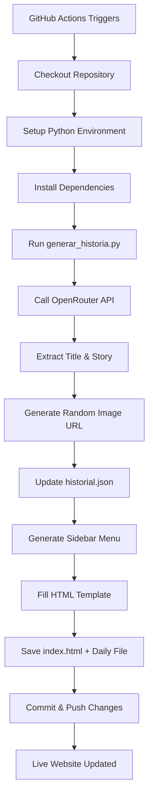

## Overview

Historia Diaria is an automated story generator that runs daily using GitHub Actions. It combines AI-powered content generation with static HTML output to create a self-updating story archive.

## System Architecture

The system consists of four main components:

<CardGroup cols={2}>
  <Card title="Python Script" icon="python">
    Core logic for API calls, content generation, and file management
  </Card>
  <Card title="GitHub Actions" icon="robot">
    Automated scheduler that runs the script daily at 8:00 AM Lima time
  </Card>
  <Card title="HTML Template" icon="file-code">
    Reusable layout with dynamic content placeholders
  </Card>
  <Card title="JSON History" icon="database">
    Persistent storage for story metadata and navigation
  </Card>
</CardGroup>

## Workflow Diagram

The automated workflow follows this sequence:



## Automated Scheduling

The GitHub Actions workflow is configured to run automatically:

```yaml actualizar.yml
name: Actualizar Historia Diaria

on:
  schedule:
    # UTC time: 13:00 = 8:00 AM Lima time
    - cron: '0 13 * * *'
  workflow_dispatch: # Manual trigger option

jobs:
  generar-pagina:
    runs-on: ubuntu-latest
    permissions:
      contents: write
```

<Info>
The `workflow_dispatch` trigger allows you to manually run the workflow from the GitHub Actions tab for testing.
</Info>

## API Integration Flow

The script connects to OpenRouter's API to generate stories:

```python generar_historia.py
# 1. API Connection
api_key = os.environ.get("OPENROUTER_API_KEY")

response = requests.post(
    url="https://openrouter.ai/api/v1/chat/completions",
    headers={
        "Authorization": f"Bearer {api_key}",
        "Content-Type": "application/json"
    },
    data=json.dumps({
        "model": "stepfun/step-3.5-flash:free",
        "messages": [{"role": "user", "content": prompt}]
    })
)

respuesta_ia = response.json()['choices'][0]['message']['content']
```

<Warning>
The API key is stored as a GitHub Secret (`OPENROUTER_API_KEY`) and passed as an environment variable during workflow execution.
</Warning>

## File Generation Process

The script generates two HTML files on each run:

<Steps>
  <Step title="Generate Daily Filename">
    Creates a date-stamped filename using the format `historia-YYYY-MM-DD.html`
    
    ```python generar_historia.py
    fecha_hoy = datetime.now()
    año = fecha_hoy.strftime("%Y")
    mes_num = fecha_hoy.strftime("%m")
    dia = fecha_hoy.strftime("%d")
    
    nombre_archivo_hoy = f"historia-{año}-{mes_num}-{dia}.html"
    ```
  </Step>
  
  <Step title="Fill Template with Content">
    Replaces placeholder variables with generated content
    
    ```python generar_historia.py
    with open('plantilla.html', 'r', encoding='utf-8') as archivo:
        contenido_html = archivo.read()
    
    contenido_html = contenido_html.replace('{{TITULO}}', nuevo_titulo)
    contenido_html = contenido_html.replace('{{HISTORIA}}', nueva_historia)
    contenido_html = contenido_html.replace('{{IMAGEN_URL}}', url_imagen)
    contenido_html = contenido_html.replace('{{MENU}}', menu_html)
    ```
  </Step>
  
  <Step title="Save Both Files">
    Writes `index.html` (latest story) and the dated archive file
    
    ```python generar_historia.py
    # Latest story (homepage)
    with open('index.html', 'w', encoding='utf-8') as archivo:
        archivo.write(contenido_html)
    
    # Archived version
    with open(nombre_archivo_hoy, 'w', encoding='utf-8') as archivo:
        archivo.write(contenido_html)
    ```
  </Step>
</Steps>

## History Management

The `historial.json` file maintains a structured archive of all generated stories:

### Data Structure

```json historial.json
{
    "Marzo 2026": [
        {
            "titulo": "El Guardián del Faro de las Sombras",
            "archivo": "historia-2026-03-04.html"
        },
        {
            "titulo": "El Código de las Estrellas",
            "archivo": "historia-2026-03-02.html"
        }
    ],
    "Febrero 2026": [
        {
            "titulo": "El Eco de los Días Perdidos",
            "archivo": "historia-2026-02-26.html"
        }
    ]
}
```

### Update Logic

The script implements smart update logic to handle re-runs on the same day:

```python generar_historia.py
# Load existing history
if os.path.exists('historial.json'):
    with open('historial.json', 'r', encoding='utf-8') as f:
        historial = json.load(f)
else:
    historial = {}

# Create month key if new
if llave_mes not in historial:
    historial[llave_mes] = []

# Update if exists, insert if new
historia_actualizada = False
for item in historial[llave_mes]:
    if item['archivo'] == nombre_archivo_hoy:
        item['titulo'] = nuevo_titulo  # Update existing
        historia_actualizada = True
        break

if not historia_actualizada:
    # Insert at beginning (newest first)
    historial[llave_mes].insert(0, {
        "titulo": nuevo_titulo,
        "archivo": nombre_archivo_hoy
    })
```

<Check>
This logic prevents duplicate entries when the workflow runs multiple times on the same day, updating the title instead of creating a new entry.
</Check>

## Error Handling

The script includes fallback mechanisms for API failures:

```python generar_historia.py
try:
    response = requests.post(
        url="https://openrouter.ai/api/v1/chat/completions",
        headers={"Authorization": f"Bearer {api_key}", "Content-Type": "application/json"},
        data=json.dumps({"model": "stepfun/step-3.5-flash:free", "messages": [{"role": "user", "content": prompt}]})
    )
    respuesta_ia = response.json()['choices'][0]['message']['content']
except Exception as e:
    respuesta_ia = "<TITULO>Error</TITULO><HISTORIA>Fallo al conectar con la API.</HISTORIA><IMAGEN>error</IMAGEN>"
```

If the API call fails, a default error message is used to ensure the workflow completes successfully.

## Next Steps

<CardGroup cols={2}>
  <Card title="Story Generation" icon="wand-magic-sparkles" href="/story-generation">
    Learn how AI generates and parses story content
  </Card>
  <Card title="HTML Templates" icon="code" href="/html-templates">
    Explore the template structure and styling system
  </Card>
</CardGroup>