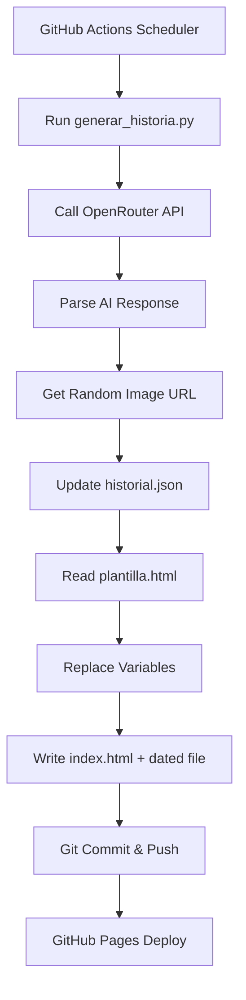

## What is Historia Diaria?

Historia Diaria is an **automated daily story generator** that uses AI to create short science fiction and fantasy stories every day. It's a demonstration project that combines the power of OpenRouter AI with GitHub Actions automation to generate, store, and display daily creative content on a beautiful web interface.

<Info>
Historia Diaria generates a new story automatically every day at 8:00 AM (Lima time) and publishes it to GitHub Pages - completely hands-free!
</Info>

## What Problem Does It Solve?

Historia Diaria showcases how to:

- **Automate creative content generation** using AI APIs in a scheduled workflow
- **Build a dynamic archive** of generated content organized by month and year
- **Deploy static sites automatically** with GitHub Actions and GitHub Pages
- **Integrate external APIs** (OpenRouter, Picsum Photos) into automated workflows
- **Learn GitHub Actions** through a practical, fun project

Whether you're learning automation, exploring AI APIs, or building a content generation pipeline, Historia Diaria provides a complete working example you can fork and customize.

## Key Features

### 🤖 AI-Powered Story Generation

Uses OpenRouter's API with the `stepfun/step-3.5-flash:free` model to generate unique stories daily. The AI follows a structured prompt to return stories with a title, narrative, and image keyword.

### ⏰ Fully Automated Workflow

GitHub Actions runs the story generation script daily at 8:00 AM Lima time (13:00 UTC). You can also trigger it manually with a button click for testing.

### 📚 Persistent History System

Stories are organized chronologically in a JSON-based history system (`historial.json`) that tracks all generated stories by month and year.

### 🎨 Beautiful Web Interface

A responsive HTML template with:
- Sidebar navigation for browsing past stories
- Random images from Picsum Photos
- Clean, modern design optimized for readability
- Mobile-friendly layout

### 🔄 Smart Update Logic

The system intelligently handles:
- Creating new entries for each day
- Updating existing entries if run multiple times per day
- Building dynamic navigation menus from the history
- Generating both `index.html` and dated archive files

## Architecture Overview

Historia Diaria consists of three main components:

<Accordion title="1. Story Generation Script (generar_historia.py)">

The core Python script that:
1. Connects to OpenRouter API with your API key
2. Sends a structured prompt requesting a story
3. Parses the AI response using regex to extract title and content
4. Generates a unique image URL using Picsum Photos
5. Updates the history JSON file
6. Renders the HTML template with new content

**Key Technologies**: Python 3.10, requests library, regex, JSON

</Accordion>

<Accordion title="2. GitHub Actions Workflow (actualizar.yml)">

The automation engine that:
1. Runs on a daily schedule (13:00 UTC)
2. Sets up a Python environment on Ubuntu
3. Installs dependencies (requests)
4. Executes the generation script with API key from secrets
5. Commits and pushes changes back to the repository

**Key Technologies**: GitHub Actions, Ubuntu runner, Python setup action

</Accordion>

<Accordion title="3. HTML Template System (plantilla.html)">

A responsive web template featuring:
- Variable placeholders for dynamic content (`{{TITULO}}`, `{{HISTORIA}}`, `{{IMAGEN_URL}}`, `{{MENU}}`)
- Sidebar navigation with toggle functionality
- Modern styling with CSS
- JavaScript for interactive menu

**Key Technologies**: HTML5, CSS3, JavaScript

</Accordion>

### Data Flow Diagram



## History File Structure

The `historial.json` file organizes stories by month:

```json
{
    "Marzo 2026": [
        {
            "titulo": "El Guardián del Faro de las Sombras",
            "archivo": "historia-2026-03-04.html"
        },
        {
            "titulo": "El Código de las Estrellas",
            "archivo": "historia-2026-03-02.html"
        }
    ],
    "Febrero 2026": [
        {
            "titulo": "El Eco de los Días Perdidos",
            "archivo": "historia-2026-02-26.html"
        }
    ]
}
```

Each month contains an array of story objects with the title and filename, ordered with the newest stories first.

## Technical Requirements

- **Python**: 3.10 or higher
- **Dependencies**: `requests` library
- **API Key**: OpenRouter API key (free tier available)
- **Hosting**: GitHub Pages (free)
- **Repository**: GitHub repository with Actions enabled

## Use Cases

<CardGroup cols={2}>
  <Card title="Learning GitHub Actions" icon="graduation-cap">
    Understand how to set up scheduled workflows, secrets, and automated deployments
  </Card>
  <Card title="Content Generation" icon="wand-magic-sparkles">
    Create automated content pipelines for blogs, newsletters, or creative projects
  </Card>
  <Card title="API Integration" icon="plug">
    Learn how to integrate external APIs into automated workflows
  </Card>
  <Card title="Template Systems" icon="file-code">
    Build dynamic web pages from templates and structured data
  </Card>
</CardGroup>

## Ready to Get Started?

<Card title="Quickstart Guide" icon="rocket" href="/quickstart">
  Follow our step-by-step guide to set up your own Historia Diaria instance in under 10 minutes
</Card>

<Note>
Historia Diaria is designed to be beginner-friendly. If you can fork a repository and add a secret, you can run this project!
</Note>