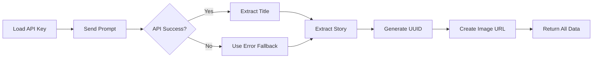

## Overview

Historia Diaria uses the OpenRouter API to generate daily science fiction and fantasy stories. The process involves prompt engineering, API communication, response parsing, and image generation.

## OpenRouter API Integration

### API Configuration

The script uses OpenRouter's chat completions endpoint with the free `stepfun/step-3.5-flash` model:

```python generar_historia.py
import os
import requests
import json

# Get API key from environment
api_key = os.environ.get("OPENROUTER_API_KEY")

# Make API request
response = requests.post(
    url="https://openrouter.ai/api/v1/chat/completions",
    headers={
        "Authorization": f"Bearer {api_key}",
        "Content-Type": "application/json"
    },
    data=json.dumps({
        "model": "stepfun/step-3.5-flash:free",
        "messages": [{"role": "user", "content": prompt}]
    })
)

respuesta_ia = response.json()['choices'][0]['message']['content']
```

<Info>
**Why OpenRouter?**

OpenRouter provides access to multiple AI models through a single API, including free models like `stepfun/step-3.5-flash:free` that are perfect for automated daily generation.
</Info>

### API Key Security

The API key is never hardcoded in the script. Instead, it's:

1. Stored as a GitHub Secret named `OPENROUTER_API_KEY`
2. Passed as an environment variable during workflow execution
3. Retrieved using `os.environ.get()` at runtime

```yaml actualizar.yml
- name: 4. Ejecutar tu script
  env:
    OPENROUTER_API_KEY: ${{ secrets.OPENROUTER_API_KEY }}
  run: python generar_historia.py
```

## Prompt Engineering

The prompt is designed to return structured, parseable output:

```python generar_historia.py
prompt = """
Escribe una historia corta de ciencia ficción o fantasía.
Debes devolver tu respuesta EXACTAMENTE en este formato:
<TITULO>Aquí va el título</TITULO>
<HISTORIA>Aquí va la historia en unos dos o tres párrafos.</HISTORIA>
<IMAGEN>una_sola_palabra_clave_en_ingles</IMAGEN>
"""
```

### Prompt Structure

<AccordionGroup>
  <Accordion title="Genre Specification" icon="book">
    **"ciencia ficción o fantasía"** - Constrains the AI to generate content within specific genres, ensuring thematic consistency across all daily stories.
  </Accordion>
  
  <Accordion title="Format Requirements" icon="brackets-curly">
    **"EXACTAMENTE en este formato"** - Strong directive that instructs the AI to follow the XML-like tag structure strictly, making regex parsing reliable.
  </Accordion>
  
  <Accordion title="Length Control" icon="text-size">
    **"unos dos o tres párrafos"** - Limits story length to maintain quick readability and consistent page layouts.
  </Accordion>
  
  <Accordion title="Image Keyword" icon="image">
    **"una_sola_palabra_clave_en_ingles"** - Originally intended for image search, now unused since the system generates random images via Picsum.
  </Accordion>
</AccordionGroup>

<Tip>
**Prompt Optimization**

The word "EXACTAMENTE" (exactly) is crucial for ensuring consistent formatting. Without it, the AI might return unstructured text that's difficult to parse.
</Tip>

## Response Parsing

### Regex Extraction

The script uses regular expressions to extract structured data from the AI response:

```python generar_historia.py
import re

# Extract title
titulo_match = re.search(r'<TITULO>(.*?)</TITULO>', respuesta_ia, re.DOTALL)

# Extract story content
historia_match = re.search(r'<HISTORIA>(.*?)</HISTORIA>', respuesta_ia, re.DOTALL)

# Extract with fallback defaults
nuevo_titulo = titulo_match.group(1).strip() if titulo_match else "Historia sin título"
nueva_historia = historia_match.group(1).strip() if historia_match else "Error al generar la historia."
```

### Regex Pattern Breakdown

| Component | Meaning |
|-----------|----------|
| `<TITULO>` | Literal opening tag |
| `(.*?)` | Capture group: any character, non-greedy |
| `</TITULO>` | Literal closing tag |
| `re.DOTALL` | Makes `.` match newlines (multi-paragraph support) |

<CodeGroup>
```python Example Response
# AI returns:
"<TITULO>El Guardián del Faro</TITULO><HISTORIA>En un planeta lejano, el faro brillaba.

Nadie sabía quién lo encendía cada noche.</HISTORIA><IMAGEN>lighthouse</IMAGEN>"
```

```python Extracted Values
nuevo_titulo = "El Guardián del Faro"

nueva_historia = "En un planeta lejano, el faro brillaba.\n\nNadie sabía quién lo encendía cada noche."
```
</CodeGroup>

### Fallback Handling

The parsing includes defensive fallbacks:

```python generar_historia.py
# If regex doesn't match, use defaults
nuevo_titulo = titulo_match.group(1).strip() if titulo_match else "Historia sin título"
nueva_historia = historia_match.group(1).strip() if historia_match else "Error al generar la historia."
```

This ensures the workflow never crashes due to unexpected AI output formats.

## Image Generation

### UUID-Based Random Images

Instead of using the AI's image keyword, the script generates random images from Picsum Photos:

```python generar_historia.py
import uuid

# Generate unique seed for consistent daily image
codigo_unico = uuid.uuid4().hex

# Create Picsum URL with seed
url_imagen = f"https://picsum.photos/seed/{codigo_unico}/600/350"
```

<Info>
**Why UUID Seeds?**

Using a UUID as the seed ensures:
- Each story gets a unique, random image
- The same image loads consistently on each page view
- No API keys or image search services required
- 600x350px dimensions provide optimal aspect ratio
</Info>

### Image URL Example

```text
https://picsum.photos/seed/a3f5c2d8e1b9f4a6c7d8e9f0a1b2c3d4/600/350
```

This URL will always return the same random photo, making the page load consistently.

## Error Handling

### API Failure Recovery

The entire API call is wrapped in a try-except block:

```python generar_historia.py
try:
    response = requests.post(
        url="https://openrouter.ai/api/v1/chat/completions",
        headers={"Authorization": f"Bearer {api_key}", "Content-Type": "application/json"},
        data=json.dumps({"model": "stepfun/step-3.5-flash:free", "messages": [{"role": "user", "content": prompt}]})
    )
    respuesta_ia = response.json()['choices'][0]['message']['content']
except Exception as e:
    respuesta_ia = "<TITULO>Error</TITULO><HISTORIA>Fallo al conectar con la API.</HISTORIA><IMAGEN>error</IMAGEN>"
```

### Error Scenarios Handled

<AccordionGroup>
  <Accordion title="Network Failures" icon="wifi-slash">
    If GitHub Actions can't reach OpenRouter's servers, the fallback response is used.
  </Accordion>
  
  <Accordion title="API Rate Limits" icon="gauge-high">
    Free tier rate limits trigger the exception handler, allowing the workflow to complete.
  </Accordion>
  
  <Accordion title="Invalid API Keys" icon="key">
    Authentication failures are caught, preventing workflow crashes.
  </Accordion>
  
  <Accordion title="Malformed Responses" icon="triangle-exclamation">
    If the JSON structure is unexpected, the exception is caught.
  </Accordion>
</AccordionGroup>

<Warning>
Even when the API fails, the script continues to execute. The error message "Fallo al conectar con la API." will be displayed on the generated page, but the site remains functional.
</Warning>

## Complete Generation Flow



## Testing Story Generation

You can test the story generation manually:

<Steps>
  <Step title="Run Locally">
    Set the environment variable and run the script:
    ```bash
    export OPENROUTER_API_KEY="your-key-here"
    python generar_historia.py
    ```
  </Step>
  
  <Step title="Manual GitHub Trigger">
    Use the "Run workflow" button in the GitHub Actions tab to trigger generation on-demand.
  </Step>
  
  <Step title="Check Output">
    Verify the generated `index.html` and daily archive file contain the expected content.
  </Step>
</Steps>

## Next Steps

<CardGroup cols={2}>
  <Card title="How It Works" icon="gear" href="/how-it-works">
    Understand the overall system architecture
  </Card>
  <Card title="HTML Templates" icon="code" href="/html-templates">
    Learn how generated content fills the template
  </Card>
</CardGroup>